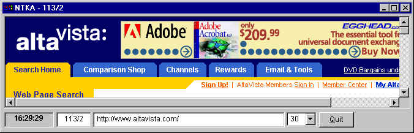



## Web Connection Keep Alive

### Description

Keeps your internet connection alive by cycling through a predetermined list of web sites (of your choosing) at intervals you specify. Thanks and kudos to Jeff Weisthaupt (spelling?) whose 12/25 submittal was the basis for this, which I jazzed up and added comments to.
 
### More Info
 
If you're paying long distance for a dial-up connection, beware! This will keep you connected...

             |
---                |---
**Submitted On**   |2000-12-27 15:42:14
**By**             |[N/A](https://github.com/Planet-Source-Code/PSCIndex/blob/master/ByAuthor/empty.md)
**Level**          |Intermediate
**User Rating**    |4.0 (16 globes from 4 users)
**Compatibility**  |VB 6\.0
**Category**       |[Internet/ HTML](https://github.com/Planet-Source-Code/PSCIndex/blob/master/ByCategory/internet-html__1-34.md)
**World**          |[Visual Basic](https://github.com/Planet-Source-Code/PSCIndex/blob/master/ByWorld/visual-basic.md)
**Archive File**   |[CODE\_UPLOAD1310012272000\.zip](https://github.com/Planet-Source-Code/web-connection-keep-alive__1-13908/archive/master.zip)

